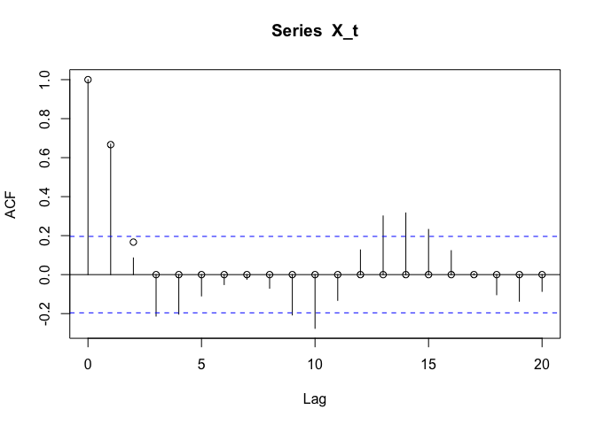
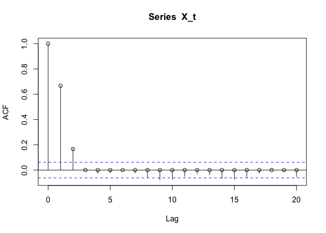
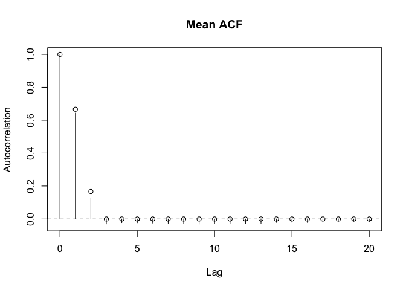

Financial econometrics: H1 - Basic Statistical and Time-Series Concepts
================

Using R, simulate n = 100 observations from the stochastic process in
Question 4, which is reproduced below for your convenience:
$X_t = Z_{t−1} +2Z_t +Z_{t+1}$ where ($Z_t$) ∼ i.i.d. N(0, $\sigma^2$)
by imposing a Normal/Gaussian distribution on $Z_t$.

1)  Calculate the simulated autocorrelation coefficients,
    $\hat{\rho}_X (h)$, for h = 1, · · · , 20 for a single
    run/replication. Briefly comment on the results, and compare and
    contrast the results obtained in this part with the analytical
    results obtained in Question 4 \[question involved calculating the
    autocorrelation function for this stochastic process analytically
    among some other exercises\].

``` r
library(tseries)
```

    ## Registered S3 method overwritten by 'quantmod':
    ##   method            from
    ##   as.zoo.data.frame zoo

    ## 
    ##     'tseries' version: 0.10-54
    ## 
    ##     'tseries' is a package for time series analysis and computational finance.
    ## 
    ##     See 'library(help="tseries")' for details.

``` r
set.seed(0)
lags <- 0:20 # array of lag values
rho_X <- c(c(1, 2/3, 1/6), rep(0,times=(21-3))) # my theoretical calculation of autocorrelation rho_X

get_X_t = function(len) {
  n = len
  Z_t <- rnorm(n+2)
  X_t <- Z_t[1:n]+2*Z_t[2:(n+1)]+Z_t[3:(n+2)]
  return(X_t)
}
```

``` r
n=100
X_t = get_X_t(n)
acf(X_t,lag.max=20, type="correlation")
points(lags, rho_X)
```

<!-- -->
It’s clear the autocorrelation drops to close to zero (expected for
h\>=3) and then somewhat randomly oscillates about zero, with the
magnitude of oscillation consistent with strong white noise.

2)  Repeat the simulation exercise in part (a) for n=1,000 still for a
    single run/replication. Critically compare and contrast the results
    obtained in this part with those in part (a).

``` r
n=1000
X_t = get_X_t(n)
acf(X_t,lag.max=20, type="correlation")
points(lags, rho_X)
```

<!-- -->
Similar qualitative behavior, with a better match to the analytically
calculated ACF values. Oscillation for lag \> 3 is smaller, consistent
with strong white noise.

3)  Repeat the simulation exercise in part (a) for n=100 but, this time,
    for 1000 runs/replications. Critically compare and contrast the
    results obtained in this part with those in part (a) and also in
    part (b).

``` r
n=100

acf_mat <- matrix(NA, nrow=1000, ncol=21)

for(i in 1:1000) {
  X_t = get_X_t(n)
  acf_mat[i,] = as.vector(acf(X_t,lag.max=20,plot=FALSE,type="correlation")$acf) #[2:21]
}

acf_mean = colMeans(acf_mat)
plot(0:20, acf_mean, type="h", xlim=c(0, 20), ylim=c(min(acf_mean), max(acf_mean)),
     xlab="Lag", ylab="Autocorrelation", main="Mean ACF")
abline(h=0, lty=2)
points(lags, rho_X)
```

<!-- -->

Similar pattern as before, now with much smaller oscillation since we’re
averaging over many trials.
