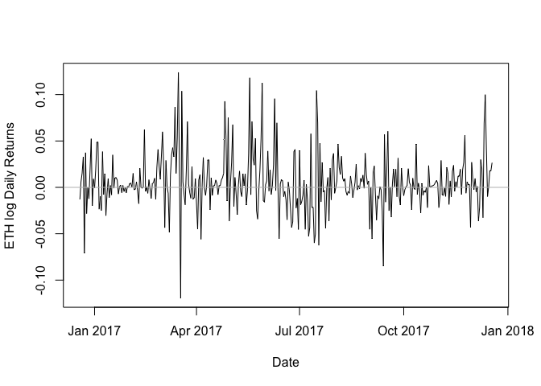

Q4 - exploratory data analysis of cryptocurrencies ETH and XRP
================

Question 4. The objective of this question is to ask you to perform a
series of Exploratory Data Anal- ysis (EDA), and to replicate some of
the results presented in class using different financial time series.
Please download the following R packages for this part of the homework:

- car
- PerformanceAnalytics
- quantmod
- tseries
- xts
- zoo

As of December 15, 2017, Bitcoin (BTC) has a market cap of USD \$297
billion. Over the same period, the prices of other major
cryptocurrencies, such as Litecoin (LTC), Ethereum (ETH), and Ripple
(XRP), also have skyrocketed. The total market cap of cryptocurren- cies
stood at only USD \$19 billion at the beginning of 2017, but has
increased to more than USD \$500 billion in the middle of December 2017.

ETH, XRP, and LTC are the other three major cryptocurrencies in terms of
market cap based on the <https://coinmarketcap.com/> on December 16,
2017. By far Bitcoin has the largest market cap of USD \$81 billion. ETH
has the second largest market cap of USD \$58.8 billion, while XRP has
the fourth largest market cap at USD \$35.6 billion. LTC has the fifth
largest market cap standing at USD \$16.4 billion.

In this question, you are asked to perform a series of EDA on the daily
data of ETH and XRP for a sample period ranging from December 18, 2016
to December. 18, 2017 (for a total of 365 Observations). The data can be
found in h2q4.xlsx which has been uploaded to the H2 submodule.

------------------------------------------------------------------------

### (a) Compute log (or continuously compounded) daily returns of ETH and XRP. Hence-

forth, these returns are referred to as returns. Provide a time plot of
the resulting time series and briefly comment on any ”stylized facts” of
these asset returns.

``` r
library(PerformanceAnalytics)
library(tseries)
library('readxl')
data = read_excel('h2q4.xlsx')
```

    ## New names:
    ## • `` -> `...4`

``` r
ETH_timeseries = data[['ETH']]
returns_ETH = diff(log10(ETH_timeseries))
plot(data[['Date']][-1], returns_ETH, type='l', ylab = 'ETH log Daily Returns', xlab = 'Date')
abline(h=0, col='grey')
```

<!-- -->
In ETH’s daily returns we can see notable volatility clustering, as well
as what appears to be a small amouunt of autoregression in some of the
noise or the volatility of the returns is clustered over small portions
of the sample period. The oscillations about a mean of ~zero indicates
this is a mean-reverting process.

``` r
XRP_timeseries = data[['XRP']]
returns_XRP = diff(log10(XRP_timeseries))
plot(data[['Date']][-1], returns_XRP, type='l', ylab = 'XRP log Daily Returns', xlab = 'Date', ylim = c(-0.5,0.5))
abline(h=0, col='grey')
```

<!-- -->
In XRP’s daily returns we again see volatility clustering, but with
larger amplitude spikes at the highest oscillations. The oscillations
about a mean of ~zero indicates this is a mean-reverting process. The
noise between volatility clusters is also larger than for ETH. A
possible underlying autoregressive feature in some of the noise seen for
ETH does not appear here.

------------------------------------------------------------------------

### (c) Repeat the exercise in part (a) for daily absolute and squared returns of ETH and XRP. Provide time plots for the resulting time series and briefly comment on any stylized facts of these asset returns.

``` r
par(mfrow = c(2, 2), mar = c(2, 4.1, 2, 2.1))
plot(data[['Date']][-1], abs(returns_ETH), type='l', ylab = 'ETH Absolute Daily Returns', xlab = 'Date')
plot(data[['Date']][-1], returns_ETH**2, type='l', ylab = 'ETH Squared Daily Returns', xlab = 'Date')

plot(data[['Date']][-1], abs(returns_XRP), type='l', ylab = 'XRP Absolute Daily Returns', xlab = 'Date')
plot(data[['Date']][-1], returns_XRP**2, type='l', ylab = 'XRP Squared Daily Returns', xlab = 'Date')
```

<!-- -->
These plots much more clearly show the volatility of the respective
cryptocurrencies, particularly where the volatility was highest. In
other words, there are periods of high volitity and low volatility.

------------------------------------------------------------------------

### (c) Assess the distributional properties of the daily returns of ETH and XRP; i.e. Create histograms and normal QQ-plots for the these two returns. Compute sample statistics (mean, SD, skewness, kurtosis) and test the null hypothesis of normality of the returns by using the JB test statistic. You can do most of this using the functions in the PerformanceAnalytics package. Alternatively, you can use the jarque.bera.test() function from the tseries package for the JB test.

``` r
par(mfrow = c(2, 2), mar = c(2, 4.1, 2, 2.1))
hist(returns_ETH, main = 'ETH Daily Returns', ylab = 'Frequency')
qqnorm(returns_ETH, main="QQ Plot of ETH Daily Returns")
qqline(returns_ETH)

hist(returns_XRP, main = 'XRP Daily Returns', ylab = 'Frequency')
qqnorm(returns_XRP, main="QQ Plot of XRP Daily Returns")
qqline(returns_XRP)
```

<!-- -->

``` r
stats = table.Stats(returns_ETH)
jarque.bera.test(returns_ETH)
```

    ## 
    ##  Jarque Bera Test
    ## 
    ## data:  returns_ETH
    ## X-squared = 152.27, df = 2, p-value < 2.2e-16

``` r
stats = table.Stats(returns_XRP)
print(stats[c("Arithmetic Mean", "Stdev", "Skewness", "Kurtosis"), , drop=FALSE])
```

    ##                        
    ## Arithmetic Mean  0.0056
    ## Stdev            0.0487
    ## Skewness         2.6534
    ## Kurtosis        25.4863

``` r
jarque.bera.test(returns_XRP)
```

    ## 
    ##  Jarque Bera Test
    ## 
    ## data:  returns_XRP
    ## X-squared = 10279, df = 2, p-value < 2.2e-16

Based on the right skews and long tails in the histograms (note the very
large kurtosis, far far larger than a value of 3 expected for a normal
distribution), as well as the departure from the straight line
(indicating normality) in the QQ plot, the distributional properties of
the daily returns for ETH and XRP do not remotely similar to a
normal/Gaussian distribution.

Unsurprisingly, given these statistical properties of the distributions,
the Jarque Bera Test rules out the null hypothesis of the distribution
of daily returns for the ETH and XRP cryptocurrencies as being drawn
from a normal distribution.

------------------------------------------------------------------------

### (d) Repeat the exercise in part (c) for the daily absolute and squared returns of ETH and XRP.

#### ETH absolute and squared daily returns

``` r
par(mfrow = c(2, 2), mar = c(2, 4.1, 2, 2.1))
hist(abs(returns_ETH), main = 'ETH Absolute Daily Returns', ylab = 'Frequency')
qqnorm(abs(returns_ETH), main="QQ Plot: ETH Absolute Daily Returns")
qqline(abs(returns_ETH))

hist(returns_ETH**2, main = 'ETH Squared Daily Returns', ylab = 'Frequency')
qqnorm(returns_ETH**2, main="QQ Plot: ETH Squared Daily Returns")
qqline(returns_ETH**2)
```

<!-- -->

``` r
print("Statistics for ETH Absolute Daily Returns:")
```

    ## [1] "Statistics for ETH Absolute Daily Returns:"

``` r
stats = table.Stats(abs(returns_ETH))
print(stats[c("Arithmetic Mean", "Stdev", "Skewness", "Kurtosis"), , drop=FALSE])
```

    ##                       
    ## Arithmetic Mean 0.0204
    ## Stdev           0.0226
    ## Skewness        1.9875
    ## Kurtosis        4.5122

``` r
jarque.bera.test(abs(returns_ETH))
```

    ## 
    ##  Jarque Bera Test
    ## 
    ## data:  abs(returns_ETH)
    ## X-squared = 548.44, df = 2, p-value < 2.2e-16

``` r
print("Statistics for ETH Squared Daily Returns:")
```

    ## [1] "Statistics for ETH Squared Daily Returns:"

``` r
stats = table.Stats(returns_ETH**2)
print(stats[c("Arithmetic Mean", "Stdev", "Skewness", "Kurtosis"), , drop=FALSE])
```

    ##                        
    ## Arithmetic Mean  0.0009
    ## Stdev            0.0021
    ## Skewness         4.1733
    ## Kurtosis        20.0460

``` r
jarque.bera.test(returns_ETH**2)
```

    ## 
    ##  Jarque Bera Test
    ## 
    ## data:  returns_ETH^2
    ## X-squared = 7151.2, df = 2, p-value < 2.2e-16

#### XRP absolute and squared daily returns

``` r
par(mfrow = c(2, 2), mar = c(2, 4.1, 2, 2.1))
hist(abs(returns_XRP), main = 'XRP Absolute Daily Returns', ylab = 'Frequency')
qqnorm(abs(returns_XRP), main="QQ Plot: XRP Absolute Daily Returns")
qqline(abs(returns_XRP))

hist(returns_XRP**2, main = 'XRP Squared Daily Returns', ylab = 'Frequency')
qqnorm(returns_XRP**2, main="QQ Plot: XRP Squared Daily Returns")
qqline(returns_XRP**2)
```

<!-- -->

``` r
print("Statistics for XRP Absolute Daily Returns:")
```

    ## [1] "Statistics for XRP Absolute Daily Returns:"

``` r
stats = table.Stats(abs(returns_XRP))
print(stats[c("Arithmetic Mean", "Stdev", "Skewness", "Kurtosis"), , drop=FALSE])
```

    ##                        
    ## Arithmetic Mean  0.0266
    ## Stdev            0.0412
    ## Skewness         5.1851
    ## Kurtosis        39.2800

``` r
jarque.bera.test(abs(returns_XRP))
```

    ## 
    ##  Jarque Bera Test
    ## 
    ## data:  abs(returns_XRP)
    ## X-squared = 25032, df = 2, p-value < 2.2e-16

``` r
print("Statistics for XRP Squared Daily Returns:")
```

    ## [1] "Statistics for XRP Squared Daily Returns:"

``` r
stats = table.Stats(returns_XRP**2)
print(stats[c("Arithmetic Mean", "Stdev", "Skewness", "Kurtosis"), , drop=FALSE])
```

    ##                         
    ## Arithmetic Mean   0.0024
    ## Stdev             0.0127
    ## Skewness         12.4961
    ## Kurtosis        183.5530

``` r
jarque.bera.test(returns_XRP**2)
```

    ## 
    ##  Jarque Bera Test
    ## 
    ## data:  returns_XRP^2
    ## X-squared = 520464, df = 2, p-value < 2.2e-16

Skewness and kurtosis are dramatically increased for the absolute and
square of the log-returns, with normality (null hypothesis) strongly
rejected by the Jarque Bera tests.

### (e) Assess the serial correlation properties of the daily returns of ETH and XRP by assum- ing incorrectly that both returns are ”strong” white noises. Plot the sample ACFs with the approximate 95% confidence intervals and comment on these plots. Also compute the Ljung-Box-Pierce modified Q statistic for the first 10 lags (by assuming that both returns are identically distributed under the null hypothesis without subjecting this assumption to a test at the same time) and use these statistics to test the null hypothesis that the returns are serially uncorrelated. You can use the Box.test() function from the stats package for this. Interpret the test results.

``` r
acf(returns_ETH, main='Autocorrelation function: ETH Daily Returns')
```

<!-- -->
Visually and based on the Box-Ljung test results suggest that the sample
ACF are (largely) within the 95% confidence intervals. In other words we
do not reject the null hypothesis of no correlation.

``` r
print("Ljung-Box-Pierce modified Q test statistic")
```

    ## [1] "Ljung-Box-Pierce modified Q test statistic"

``` r
print("")
```

    ## [1] ""

``` r
for (i in 1:10) {
  boxtest = Box.test(returns_ETH, lag=i, type = "Ljung-Box")
  cat("lag =", i, ": ", "Chi^2=", boxtest$statistic, "df=", boxtest$parameter, "p-value=", boxtest$p.value, "\n")
}
```

    ## lag = 1 :  Chi^2= 0.2074385 df= 1 p-value= 0.6487825 
    ## lag = 2 :  Chi^2= 0.9737629 df= 2 p-value= 0.6145399 
    ## lag = 3 :  Chi^2= 2.250765 df= 3 p-value= 0.5220186 
    ## lag = 4 :  Chi^2= 4.159291 df= 4 p-value= 0.3848771 
    ## lag = 5 :  Chi^2= 5.027106 df= 5 p-value= 0.4125812 
    ## lag = 6 :  Chi^2= 5.652987 df= 6 p-value= 0.4631624 
    ## lag = 7 :  Chi^2= 5.901899 df= 7 p-value= 0.5512498 
    ## lag = 8 :  Chi^2= 6.064476 df= 8 p-value= 0.6400097 
    ## lag = 9 :  Chi^2= 6.180163 df= 9 p-value= 0.7217602 
    ## lag = 10 :  Chi^2= 6.356889 df= 10 p-value= 0.7844409

``` r
acf(returns_XRP, main='Autocorrelation function: XRP Daily Returns')
```

<!-- -->
The sample ACF values are somewhat larger, with the lag=2 ACF value
excluded by the 95% confidence intervals. This would indicate rejection
of the null hypothesis (no correlation). The Box-Ljung test agrees with
this for lag\>1.

``` r
print("Ljung-Box-Pierce modified Q test statistic")
```

    ## [1] "Ljung-Box-Pierce modified Q test statistic"

``` r
print("")
```

    ## [1] ""

``` r
for (i in 1:10) {
  boxtest = Box.test(returns_XRP, lag=i, type = "Ljung-Box")
  cat("lag =", i, ": ", "Chi^2=", boxtest$statistic, "df=", boxtest$parameter, "p-value=", boxtest$p.value, "\n")
}
```

    ## lag = 1 :  Chi^2= 3.463066 df= 1 p-value= 0.06275384 
    ## lag = 2 :  Chi^2= 14.62277 df= 2 p-value= 0.0006678902 
    ## lag = 3 :  Chi^2= 15.99249 df= 3 p-value= 0.001138012 
    ## lag = 4 :  Chi^2= 17.12018 df= 4 p-value= 0.001831734 
    ## lag = 5 :  Chi^2= 18.86788 df= 5 p-value= 0.002034137 
    ## lag = 6 :  Chi^2= 19.58849 df= 6 p-value= 0.003277024 
    ## lag = 7 :  Chi^2= 20.19457 df= 7 p-value= 0.005164394 
    ## lag = 8 :  Chi^2= 21.96158 df= 8 p-value= 0.004987534 
    ## lag = 9 :  Chi^2= 29.95078 df= 9 p-value= 0.0004472619 
    ## lag = 10 :  Chi^2= 30.49261 df= 10 p-value= 0.0007112622

### (f) Repeat the exercise in part (e) for the daily absolute and squared returns of ETH and XRP.

``` r
par(mfrow = c(2, 2), mar = c(2, 4.1, 2, 2.1))
acf(abs(returns_ETH), ylab='ACF: ETH Abs Daily Returns')
acf(returns_ETH**2, ylab='ACF: ETH Squared Daily Returns')

acf(abs(returns_XRP), ylab='ACF: XRP Abs Daily Returns')
acf(returns_XRP**2, ylab='ACF: XRP Squared Daily Returns')
```

<!-- -->

``` r
print("Ljung-Box-Pierce modified Q test statistic: ETH Abs Daily Returns")
```

    ## [1] "Ljung-Box-Pierce modified Q test statistic: ETH Abs Daily Returns"

``` r
print("")
```

    ## [1] ""

``` r
for (i in 1:10) {
  boxtest = Box.test(abs(returns_ETH), lag=i, type = "Ljung-Box")
  cat("lag =", i, ": ", "Chi^2=", boxtest$statistic, "df=", boxtest$parameter, "p-value=", boxtest$p.value, "\n")
}
```

    ## lag = 1 :  Chi^2= 26.59241 df= 1 p-value= 2.512284e-07 
    ## lag = 2 :  Chi^2= 41.38498 df= 2 p-value= 1.031256e-09 
    ## lag = 3 :  Chi^2= 55.74672 df= 3 p-value= 4.757639e-12 
    ## lag = 4 :  Chi^2= 61.90545 df= 4 p-value= 1.153189e-12 
    ## lag = 5 :  Chi^2= 70.93847 df= 5 p-value= 6.539214e-14 
    ## lag = 6 :  Chi^2= 83.34583 df= 6 p-value= 7.771561e-16 
    ## lag = 7 :  Chi^2= 83.62439 df= 7 p-value= 2.553513e-15 
    ## lag = 8 :  Chi^2= 84.54505 df= 8 p-value= 5.884182e-15 
    ## lag = 9 :  Chi^2= 84.60331 df= 9 p-value= 1.953993e-14 
    ## lag = 10 :  Chi^2= 84.74826 df= 10 p-value= 5.850875e-14

``` r
print("Ljung-Box-Pierce modified Q test statistic: ETH Squared Daily Returns")
```

    ## [1] "Ljung-Box-Pierce modified Q test statistic: ETH Squared Daily Returns"

``` r
print("")
```

    ## [1] ""

``` r
for (i in 1:10) {
  boxtest = Box.test(returns_ETH**2, lag=i, type = "Ljung-Box")
  cat("lag =", i, ": ", "Chi^2=", boxtest$statistic, "df=", boxtest$parameter, "p-value=", boxtest$p.value, "\n")
}
```

    ## lag = 1 :  Chi^2= 15.14425 df= 1 p-value= 9.960125e-05 
    ## lag = 2 :  Chi^2= 30.83346 df= 2 p-value= 2.016506e-07 
    ## lag = 3 :  Chi^2= 44.36326 df= 3 p-value= 1.263486e-09 
    ## lag = 4 :  Chi^2= 44.53844 df= 4 p-value= 4.958878e-09 
    ## lag = 5 :  Chi^2= 48.83031 df= 5 p-value= 2.403728e-09 
    ## lag = 6 :  Chi^2= 52.82122 df= 6 p-value= 1.274683e-09 
    ## lag = 7 :  Chi^2= 52.87363 df= 7 p-value= 3.926346e-09 
    ## lag = 8 :  Chi^2= 53.0628 df= 8 p-value= 1.048695e-08 
    ## lag = 9 :  Chi^2= 53.34477 df= 9 p-value= 2.514279e-08 
    ## lag = 10 :  Chi^2= 53.50368 df= 10 p-value= 6.002305e-08

``` r
print("Ljung-Box-Pierce modified Q test statistic: XRP Abs Daily Returns")
```

    ## [1] "Ljung-Box-Pierce modified Q test statistic: XRP Abs Daily Returns"

``` r
print("")
```

    ## [1] ""

``` r
for (i in 1:10) {
  boxtest = Box.test(abs(returns_XRP), lag=i, type = "Ljung-Box")
  cat("lag =", i, ": ", "Chi^2=", boxtest$statistic, "df=", boxtest$parameter, "p-value=", boxtest$p.value, "\n")
}
```

    ## lag = 1 :  Chi^2= 60.37272 df= 1 p-value= 7.882583e-15 
    ## lag = 2 :  Chi^2= 87.16679 df= 2 p-value= 0 
    ## lag = 3 :  Chi^2= 105.2584 df= 3 p-value= 0 
    ## lag = 4 :  Chi^2= 113.2603 df= 4 p-value= 0 
    ## lag = 5 :  Chi^2= 118.1077 df= 5 p-value= 0 
    ## lag = 6 :  Chi^2= 121.1023 df= 6 p-value= 0 
    ## lag = 7 :  Chi^2= 131.9987 df= 7 p-value= 0 
    ## lag = 8 :  Chi^2= 135.194 df= 8 p-value= 0 
    ## lag = 9 :  Chi^2= 146.3384 df= 9 p-value= 0 
    ## lag = 10 :  Chi^2= 148.7847 df= 10 p-value= 0

``` r
print("Ljung-Box-Pierce modified Q test statistic: XRP Squared Daily Returns")
```

    ## [1] "Ljung-Box-Pierce modified Q test statistic: XRP Squared Daily Returns"

``` r
print("")
```

    ## [1] ""

``` r
for (i in 1:10) {
  boxtest = Box.test(returns_ETH**2, lag=i, type = "Ljung-Box")
  cat("lag =", i, ": ", "Chi^2=", boxtest$statistic, "df=", boxtest$parameter, "p-value=", boxtest$p.value, "\n")
}
```

    ## lag = 1 :  Chi^2= 15.14425 df= 1 p-value= 9.960125e-05 
    ## lag = 2 :  Chi^2= 30.83346 df= 2 p-value= 2.016506e-07 
    ## lag = 3 :  Chi^2= 44.36326 df= 3 p-value= 1.263486e-09 
    ## lag = 4 :  Chi^2= 44.53844 df= 4 p-value= 4.958878e-09 
    ## lag = 5 :  Chi^2= 48.83031 df= 5 p-value= 2.403728e-09 
    ## lag = 6 :  Chi^2= 52.82122 df= 6 p-value= 1.274683e-09 
    ## lag = 7 :  Chi^2= 52.87363 df= 7 p-value= 3.926346e-09 
    ## lag = 8 :  Chi^2= 53.0628 df= 8 p-value= 1.048695e-08 
    ## lag = 9 :  Chi^2= 53.34477 df= 9 p-value= 2.514279e-08 
    ## lag = 10 :  Chi^2= 53.50368 df= 10 p-value= 6.002305e-08

Visual inspection of the ACFs show clear exclusion by the 95% confidence
intervals for several lags, so we can reject the null hypothesis that
there is no correlation (across time) of the absolute and squared daily
returns for both ETH and XRP. This is also especially clear from the p~0
p-values from the Box-Ljung test.
